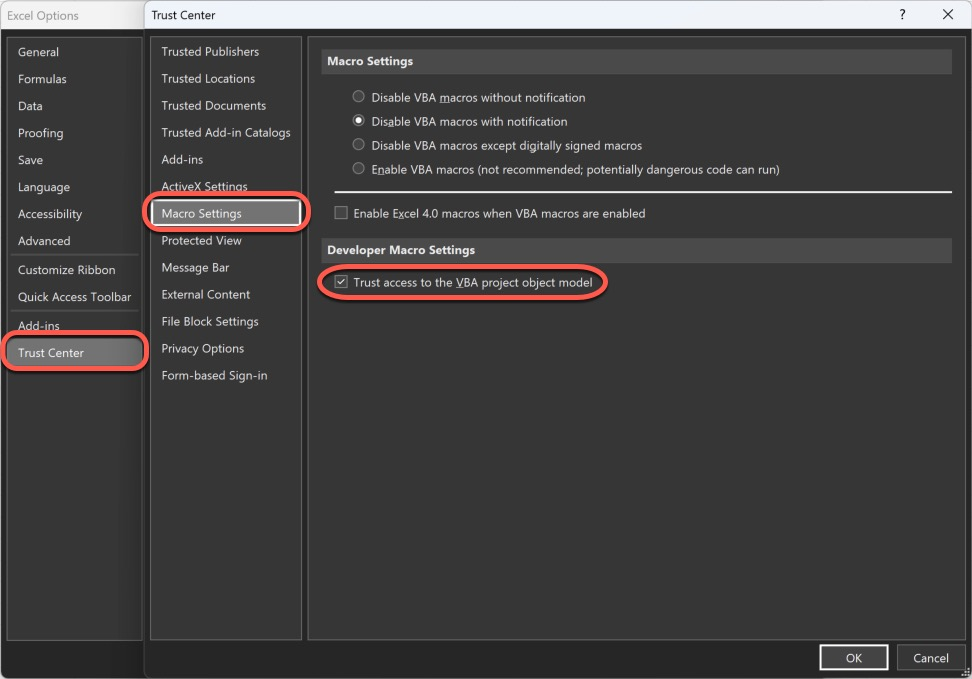

    <h3><em>Table of contents - program documentation</em></h3>

1. **`Program initial setup steps`** &larr; ***You are viewing this document***

2. **[Program userform layout and process](userform-elements.md)**

3. **[Program constants](constants.md)**

4. **[Program initiation layout and process](program-initiation.md)**

5. **[Program termination layout and process](program-termination.md)**

6. **[Program logging layout and process](program-logging.md)**

7. **[Design initiation layout and process](design-initiation.md)**

8. **[Design termination layout and end process](design-termination.md)**

9. **[Design compliance check layout and process](design-compliance-check.md)**

10. **[Design reset layout and process](design-reset.md)**

11. **[Design menu layout and process](design-menu.md)**

12. **[Design message layout and process](design-message.md)**

13. **[Create table layout and process](create-table.md)**

14. **[Modify table layout and process](modify-table.md)**

15. **[Delete table layout and process](delete-table.md)**

16. **[View table layout and process](view-table.md)**

17. **[Reset table layout and process](reset-table.md)**

18. **[Add table record layout and process](add-table-record.md)**

19. **[Modify table record layout and process](modify-table-record.md)**

20. **[Delete table record layout and process](delete-table-record.md)**

21. **[View table record layout and process](view-table-record.md)**

22. **[View incomplete table records layout and process](view-incomplete-table-records.md)**

23. **[Generate schema code layout and process](generate-schema-code.md)**

24. **[View generated schema code layout and process](view-generated-schema-code.md)**

25. **[Back end tables layout and process](backend-tables.md)**

26. **[Back end sheets layout and process](backend-sheets.md)**

27. **[Back end access layout and process](backend-access.md)**

# Program initial setup steps

This document provides the steps that must be performed for setting up the Excel to have the required dependencies enabled so that the userforms and other parameters which use those dependencies can be used accordingly.

## Steps

All the below steps must be performed only on Excel application in windows, as the program uses macros and userforms extensively and they are not supported on mac.

1. The Excel application must be installed in windows machine. The installation steps can be found **[here](https://support.microsoft.com/en-us/office/download-and-install-or-reinstall-microsoft-365-or-office-2021-on-a-pc-or-mac-4414eaaf-0478-48be-9c42-23adc4716658#InstallSteps=Install_on_a_PC)**.

2. Open the program **[life-engine-designer.xlsm](../life-engine-designer.xlsm)** file.

3. Enable the **`Developer`** tab if not already enabled.
<h6 align=center>
    <em>File &rarr; Options &rarr; Customize Ribbon &rarr; Select Developer(Customize Ribbon column)</em>
    

</h6>

4. Open the **`VB Editor`** via the developer tab or by pressing **`Alt+F11`**.
<h6 align=center>
    <em>Developer Tab &rarr; VB Editor</em>
    

</h6>

5. In the **`VB Editor`** open references window and add the references mentioned later.
<h6 align=center>
    <em>Tools &rarr; References</em>
    

</h6>

6. Select the **`Microsoft Forms 2.0 Object Library`** reference. This reference is required to access the userform objects within the program's macros.
<h6 align=center>
    <em>Microsoft Forms 2.0 Object Library</em>
    

</h6>

7. Select the **`Microsoft Visual Basic for Applications Extensibility 5.3`** reference. This reference is required to access the VB editor objects within the program's macros.
<h6 align=center>
    <em>Microsoft Visual Basic for Applications Extensibility 5.3</em>
    

</h6>

8. Select the **`Microsoft Scripting Runtime`** reference. This reference is required to access the various objects like the dictionary, file system etc. within the program's macros.
<h6 align=center>
    <em>Microsoft Scripting Runtime</em>
    

</h6>

9. To access the VB editor objects in the program's macros, the access must be trusted and it must be enabled.
<h6 align=center>
    <em>File &rarr; Options &rarr; Trust Center &rarr; Trust Center Settings &rarr; Macro Settings &rarr; Trust access to the VBA project object model</em>
    

</h6>